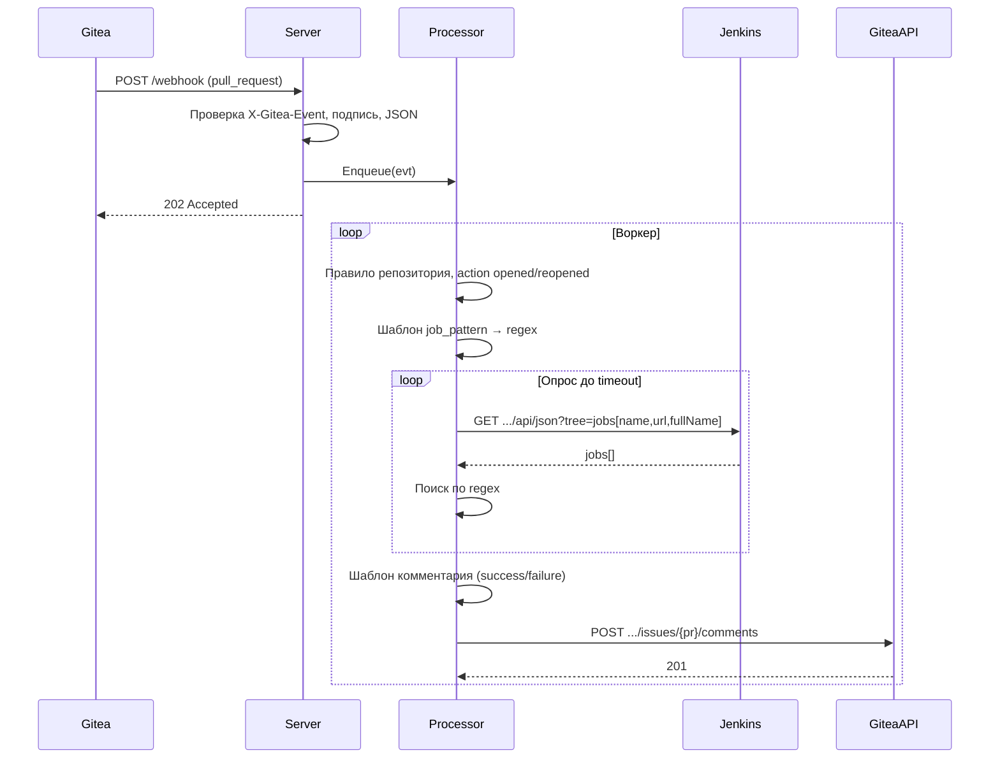
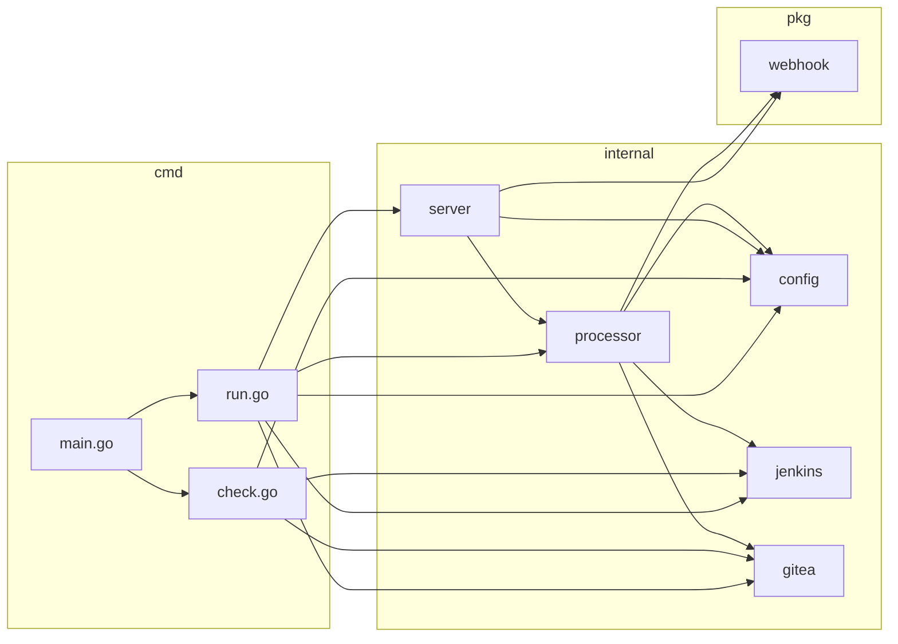

# Архитектура

## Компоненты

Сервис состоит из точки входа (CLI с командами `run` и `check`), HTTP-сервера, процессора событий с очередью и воркерами, клиентов Jenkins и Gitea.

- **Точка входа**: `cmd/webhook-service` — разбор команд (`run`, `check`), загрузка конфига, запуск сервера или проверки.
- **HTTP-сервер**: приём вебхуков, проверка подписи, декодирование payload, постановка событий в очередь.
- **Процессор**: очередь событий, пул воркеров, обработка PR-событий (фильтрация по репозиторию и действию), опрос Jenkins, генерация комментария по шаблону, публикация в Gitea.
- **Jenkins**: REST API — получение списка джоб по `job_root`, ожидание появления джобы по regex.
- **Gitea**: REST API — публикация комментария в issue/PR.

## Поток данных

**Вход**: HTTP POST на `/webhook` с телом — JSON события Gitea `pull_request`.  
**Обработка**: событие в очередь → воркер выбирает правило по `repository.full_name` → только `action` = `opened` или `reopened` → шаблон `job_pattern` с данными PR → опрос Jenkins по `job_root` до таймаута → шаблон комментария (success/failure) → POST комментария в Gitea.  
**Выход**: комментарий в PR в Gitea (ссылка на джобу или сообщение об отсутствии).

## Пакеты / модули

| Путь | Назначение |
|------|------------|
| `cmd/webhook-service` | Точка входа: команды `run`, `check`; флаги `-config`, `-debug`. |
| `internal/config` | Загрузка YAML, структуры конфига, `Validate()`, `GetRepositoryRule()`, `NewHTTPClient()`. |
| `internal/server` | HTTP-сервер: `GET /health`, `POST /webhook`; проверка подписи HMAC-SHA256; запуск/остановка процессора. |
| `internal/processor` | Очередь, пул воркеров, `Enqueue`, обработка события (правило → Jenkins → шаблон комментария → Gitea). |
| `internal/jenkins` | Клиент: `WaitForJob`, `GetJobs`, `CheckAccessibility`, `CheckJobRootExists`; API `tree=jobs[name,url,fullName]`. |
| `internal/gitea` | Клиент: `PostComment`, `CheckAccessibility`, `GetRepository`. |
| `pkg/webhook` | Типы событий Gitea: `PullRequestEvent`, `PullRequest`, `Repository`, `Sender`. |

## Диаграмма компонентов

Команда `run`: загрузка конфига → создание HTTP-клиентов (Jenkins, Gitea) → создание процессора и сервера → обработка SIGINT/SIGTERM → `srv.Run(ctx)`. Команда `check`: загрузка конфига → проверки (файл, валидация, сервер, Jenkins, Gitea, репозитории и джобы).

## Карта файлов и каталогов

Назначение основных каталогов и файлов для навигации по проекту.

**Корень:** [go.mod](../go.mod), [go.sum](../go.sum) — модуль и зависимости; [Makefile](../Makefile) — сборка, тесты, линт, Docker; [config.example.yaml](../config.example.yaml) — пример конфига; [Dockerfile](../Dockerfile), [docker-compose.yml](../docker-compose.yml); [README.md](../README.md); [doc/](../doc/) — доп. документация (напр. [TZ_CHECK_COMMAND.md](../doc/TZ_CHECK_COMMAND.md)).

**cmd/webhook-service:** [main.go](../cmd/webhook-service/main.go) — разбор команд `run`/`check`, `setupLogger`; [run.go](../cmd/webhook-service/run.go) — команда `run`; [check.go](../cmd/webhook-service/check.go) — команда `check`.

**internal/config:** [config.go](../internal/config/config.go) — структуры конфига, `Load`, `Validate`, `GetRepositoryRule`, `NewHTTPClient`; [config_test.go](../internal/config/config_test.go) — тесты.

**internal/server:** [server.go](../internal/server/server.go) — HTTP `GET /health`, `POST /webhook`, проверка подписи, запуск/остановка процессора; [server_test.go](../internal/server/server_test.go) — тесты.

**internal/processor:** [processor.go](../internal/processor/processor.go) — очередь, воркеры, обработка события, шаблоны; [processor_test.go](../internal/processor/processor_test.go) — тесты.

**internal/jenkins:** [client.go](../internal/jenkins/client.go) — клиент Jenkins API; [client_test.go](../internal/jenkins/client_test.go) — тесты; [integration_test.go](../internal/jenkins/integration_test.go) — интеграционные тесты (build tag `integration`).

**internal/gitea:** [client.go](../internal/gitea/client.go) — клиент Gitea API; [client_test.go](../internal/gitea/client_test.go) — тесты; [integration_test.go](../internal/gitea/integration_test.go) — интеграционные тесты (build tag `integration`).

**pkg/webhook:** [types.go](../pkg/webhook/types.go) — типы событий Gitea; [types_test.go](../pkg/webhook/types_test.go) — тесты.

**Тестирование:** вся документация по тестам — в [docs/test/](test/README.md): тест-планы по функциям ([test-plans.md](test/test-plans.md)), примеры запросов к Jenkins/Gitea ([integration-requests.md](test/integration-requests.md)). Интеграционные тесты в `internal/jenkins` и `internal/gitea` компилируются с тегом `integration` и пропускаются без переменных окружения.

**Конфиг и CI:** конфиг приложения — YAML по пути из `-config`. CI: [.github/workflows/ci.yml](../.github/workflows/ci.yml).

## Контекст для агентов

- **Стек:** Go 1.22. Точка входа: [cmd/webhook-service](../cmd/webhook-service) (команды `run`, `check`; флаги `-config`, `-debug`). Конфиг: один YAML, загрузка в [internal/config](../internal/config/config.go) — `Load(path)`, `Validate()`.
- **Где что искать:** компоненты и поток — разделы выше; пакеты — таблица «Пакеты / модули»; файлы — «Карта файлов и каталогов». Термины — [glossary.md](glossary.md). Контракт API — [api-surface.md](api-surface.md). Типовые изменения — [common-tasks.md](common-tasks.md). Стиль кода — [conventions.md](conventions.md).
